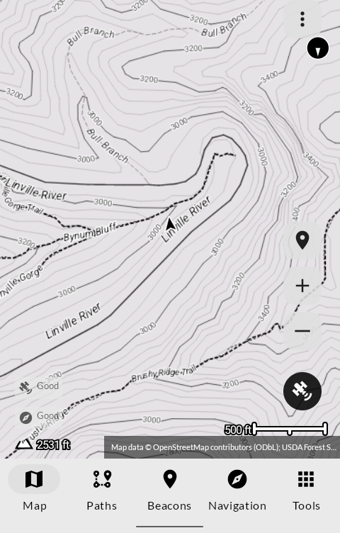
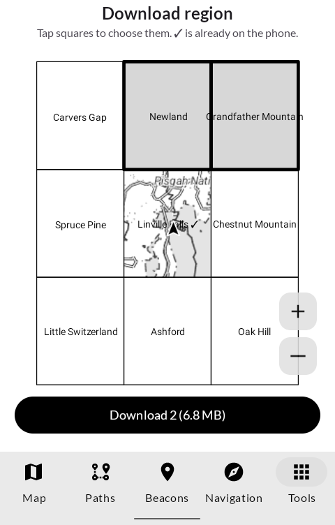
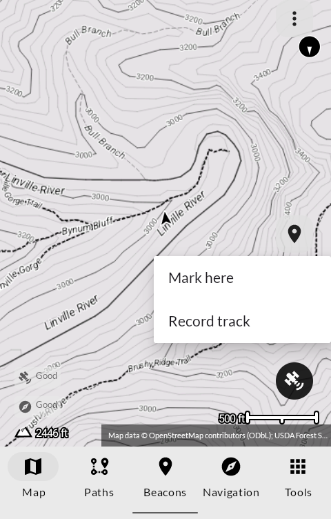
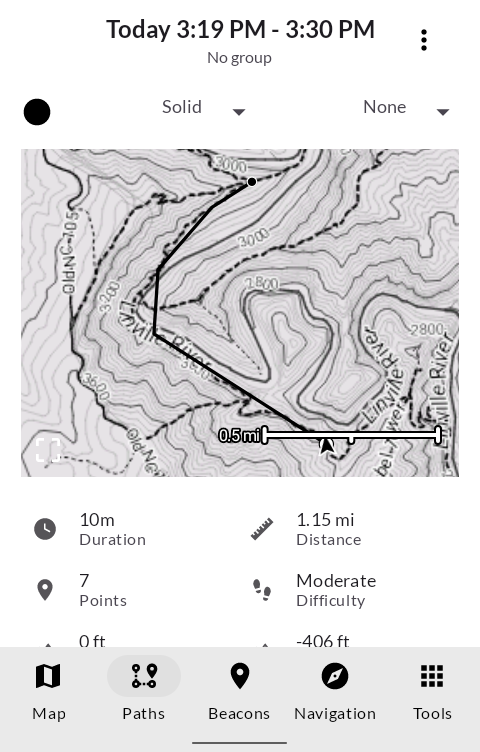

# Topo

地形 *chikei*

Topographic maps for the trail on an E Ink phone: contours, public land, forest roads,
trails and lot lines, drawn in black and white like a paper quadrangle, and there with no
signal.

*Chikei* is the lie of the land: the ordinary word for the shape of the ground a topo map
sets out to show.

Built for the [Mudita Kompakt](https://mudita.com/products/kompakt/), whose 4.3" panel has
sixteen greys, a slow redraw, and is read on a ridge as often as at a desk.

## Screenshots

| | | | |
|---|---|---|---|
|  |  |  |  |

## What it shows

- **Contours** every 40 ft, labelled every 200, from the USGS 3DEP 10 m elevation model
- **Public land** as a light grey tint with its boundary, from the Forest Service's own
  ownership parcels; private land stays white
- **Lot lines** on private land, where the state publishes them (North Carolina so far)
- **Forest roads** with their numbers, and **Forest Service trails** by name
- Everything OpenStreetMap knows: roads, tracks, paths, water, peaks, places

## What it does

- **Download region** shows the country as named USGS 7.5-minute quadrangles on a map.
  Tap the squares you need; each comes with its own elevation, and neighbours join without
  a seam.
- **Here**, on the map: mark where you are standing, or start and stop recording your track.
- **Share GPX** hands a recorded track to CalTopo, or to anything else that takes GPX.
- Navigate to a marked place, with distance, bearing and elevation.

## What it needs

- **Location**, to put you on the map and record tracks. It stays on the phone.
- **Internet**, only to download regions from the map server you set, and only when you ask.
- **A map server.** Regions are plain files built by the scripts in [`mapdata/`](mapdata)
  from public data and served by anything that serves files: `tailscale serve`, nginx, a
  folder on a web host. There is no central server; you point Topo at yours.

## What it does not do

- It does not route. It shows the ground, and you choose the way.
- It does not replace a paper map and a compass.
- It does not send your location anywhere. There is no account and no analytics.

## Getting it, and keeping it

Download <https://github.com/wanderwildwood/chikei/releases/latest/download/chikei.apk> and
sideload it. That address always points at the newest release, and every release publishes a
`.sha256` beside the APK if you would rather check than trust.

For updates without doing this by hand, add this repository to
[Obtainium](https://github.com/ImranR98/Obtainium):

    https://github.com/wanderwildwood/chikei

**The application id is settled**: updates install over what you have, keeping your maps,
tracks and marks.

## Building

```
./gradlew assembleRelease
```

A release is signed by a keystore in `signing/`, which is not in this repository. Without
it the release APK builds **unsigned** and will not install anywhere; there is no fallback
key by design.

### Building regions

```
mapdata/fetch.py <west> <south> <east> <north> <area>   # public data for an area
mapdata/build_cells.py <area> <cells>                    # one pack per quadrangle
mapdata/publish.py <site> <cells>/*/                     # a static site with packs.json
```

They need Python 3 with numpy, shapely, rasterio and contourpy, and
[osmosis](https://github.com/openstreetmap/osmosis) with the
[Mapsforge map writer](https://github.com/mapsforge/mapsforge) plugin. The data comes from
OpenStreetMap (via Geofabrik's extracts), the USDA Forest Service, the USGS, and NC OneMap.
Of the county parcels only the outlines are fetched: never owners, addresses or values.

## Credit

After [Trail Sense](https://github.com/kylecorry31/Trail-Sense) by Kyle Corry, which this
is: its sensors, paths, beacons, navigation and Mapsforge rendering are Trail Sense's, cut
down to the map and what you do with it. Trail Sense is under the MIT License, kept in
[`LICENSES/MIT-Trail-Sense.txt`](LICENSES/MIT-Trail-Sense.txt).

Map data © OpenStreetMap contributors (ODbL). Public land, forest roads and trails from the
USDA Forest Service; elevation and quadrangles from the USGS; North Carolina parcels from
NC OneMap and the counties that publish them.

## Licence

GPL-3.0-only. See [LICENSE](LICENSE).

Copyright (C) 2026 wander wildwood

This program is free software: you can redistribute it and/or modify it under the terms of
the GNU General Public License as published by the Free Software Foundation, version 3.

This program is distributed in the hope that it will be useful, but WITHOUT ANY WARRANTY;
without even the implied warranty of MERCHANTABILITY or FITNESS FOR A PARTICULAR PURPOSE.
See the GNU General Public License for more details.

You should have received a copy of the GNU General Public License along with this program.
If not, see <https://www.gnu.org/licenses/>.

A map you carry into the woods should stay free to fix and share, so the changes made here
are copyleft. Trail Sense's own code keeps its MIT licence.
